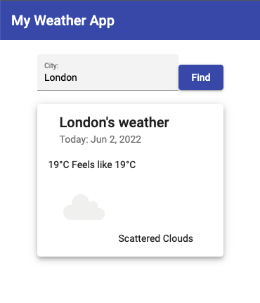

# Weather APP 🌤🌞🌈
## Table of Contents
* [General Info](#general-information)
* [Technologies Used](#technologies-used)
* [Screenshots](#screenshots)
* [Setup](#setup)
* [Project Status](#project-status)
* [Room for Improvement](#room-for-improvement)
* [Contact](#contact)

## General Information
A simple weather app with using OpenWheater API to check weather around the world!

## Technologies Used
- This project was generated with [Angular CLI](https://github.com/angular/angular-cli) version 13.2.0.

## Screenshots
### View of app

## Setup
Run `npm install` to load all necessary dependencies.
Run `ng serve` for a dev server. Navigate to `http://localhost:4200/`. The app will automatically reload if you change any of the source files.
Run `ng build` to build the project. The build artifacts will be stored in the `dist/` directory. Use the `--prod` flag for a production build.

## Project Status
Project is: _in progress_ 

## Room for Improvement
The next step in development is adding some favourite places to watchlist 
and so on..

## Contact
Created by Patryk Król

[Linkedin](https://www.linkedin.com/in/patryk-krol/) or 📧 : patrtyk.krol.98@gmail.com 
